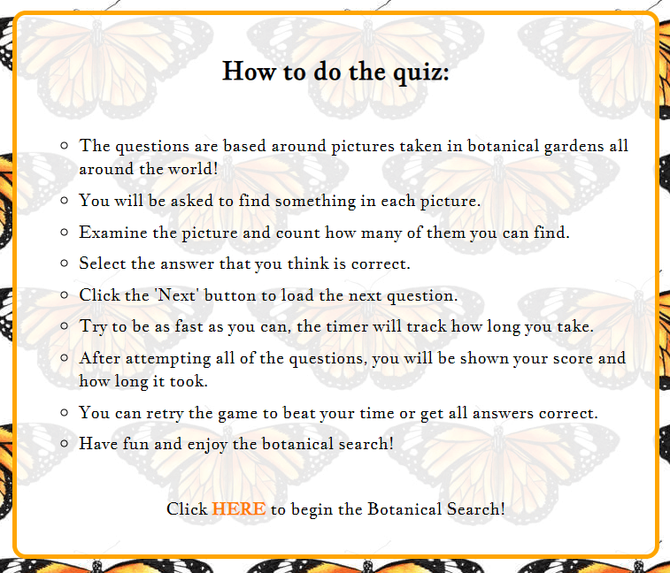

# BOTANICAL SEARCH

The aim of Botanical Search is to provide a fun challange to its users. The quiz asks users to use their keen eye to find items or features 
of the botanical garden in the picture provided. The challange that Botanical Search provides for users will bring a sense of accomplishment 
when they guess correctly, and if they don't succeed the first time, they can try again and again until they have succeeded. As well as being
a fun quiz, this kind of challange enables users to exercies their brain which is important for a healthy lifestyle. The timer brings another
element of competition to the quiz for users which makes it even more enjoyable.

The target audience for Botanical search is adults of all ages who have an interest in nature, and especially in the botanical
gardens around the world.

## UX

Botanical Search was designed around the colours of the monarch butterfly, which is frequently seen in botanical gardens. 
The quiz is kept in the center of the page so everything is clearly visible to the user and there are no distractions away from the quiz.

### Colour Scheme

- `#000000` used for primary text.
- `#FFA500` used for primary highlights.
- `#FF7900` used for secondary highlights.

### Typography

- [Source Serif Pro](https://fonts.google.com/specimen/Source+Serif+Pro) was used for the primary headers and titles.

- [Jacques Francois](https://fonts.google.com/specimen/Jacques+Francois) was used for all other secondary text.

## Features

### Existing Features

- **Heading**

    - The heading of Botanical Search is the same across the pages, this is to let the user know that they are still on the same website. 
    The logo either side of it matches the favicon, keeping the theme of the quiz visible and cohesive. The heading is also a link back to 
    the home page where the rules are listed if the user needs to refresh their memory of how the quiz works.
    

- **Quiz Instructions**

    - This section lets usesrs know what to expect of the quiz and how they can play it. The instructions are laid out in an easy to read 
    font and list format which will be easy to follow for the user.

- **Quiz Area**

    - The quiz area of Botanical Search contains the most important aspects of the quiz, that is the picture, the relevant
    question and answers, and the next button to proceed with the quiz once an answer has been selected. the contents of the quiz area
    has been laid out in the center of the page so it is easy for users to see everything they need to do in order.

- **Timer**

    - The timer is displayed at the top of the quiz page, just above the quiz area. This is so that the user will see it starting once the
    game is loaded and they will know that the quiz has begun. The user will be easily able to keep track of the time without having to 
    scroll on their device as it is displayed right above the quiz area.
    

- **Score and Final Time**

    - On completion of the quiz, the user is shown their final score and how long it took them to complete the quiz. They are also shown a
    restart button which allows them to start the quiz over again. The user will be able to see clearly how many questions they got right,
    along with how long it took them. This is important feedback for the user once they hae completed the quiz. If they want to try again
    to beat their score or their time, the restart button is there.
    

### Future Features

A useful future feature would be adding a scoreboard at the end of the quiz where people can add their name and have their score displayed along with the time it took them to make up a leaderboard.

## Testing

## Deployment

## Credits

### Content

### Media

### Acknowledgements

https://www.flaticon.com/free-icons/leaf Leaf icons created by Freepik - Flaticon