# Testing

Return back to the [README.md](README.md) file.

## Code Validation

### HTML

I have used the recommended [HTML W3C Validator](https://validator.w3.org) to validate my HTML files.

| Page | W3C URL | Screenshot | Notes |
| --- | --- | --- | --- |
| Home | [W3C](https://validator.w3.org/nu/?doc=https%3A%2F%2Fnic-wallace.github.io%2Fbotanical-search%2Findex.html) | 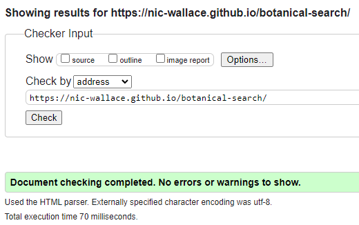 | Pass: No Errors |
| Quiz | [W3C](https://validator.w3.org/nu/?doc=https%3A%2F%2Fnic-wallace.github.io%2Fbotanical-search%2Fquiz.html) | 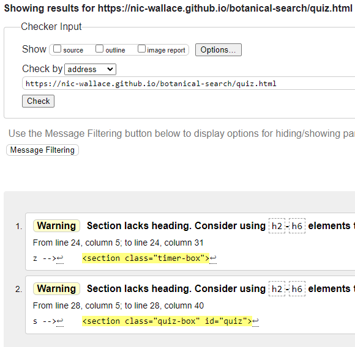 | Section lacks header h2-h6 warning |

### CSS

I have used the recommended [CSS Jigsaw Validator](https://jigsaw.w3.org/css-validator) to validate my CSS file.

| File | Jigsaw URL | Screenshot | Notes |
| --- | --- | --- | --- |
| style.css | [Jigsaw](https://jigsaw.w3.org/css-validator/validator?uri=https%3A%2F%2Fnic-wallace.github.io%2Fbotanical-search%2Findex.html&profile=css3svg&usermedium=all&warning=1&vextwarning=&lang=en) | 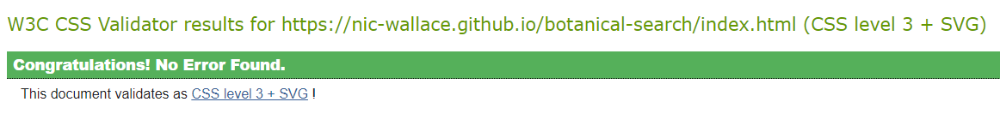 | Pass: No Errors |

### JavaScript

I have used the recommended [JShint Validator](https://jshint.com) to validate all of my JavaScript files.

| File | Screenshot | Notes |
| --- | --- | --- |
| script.js | 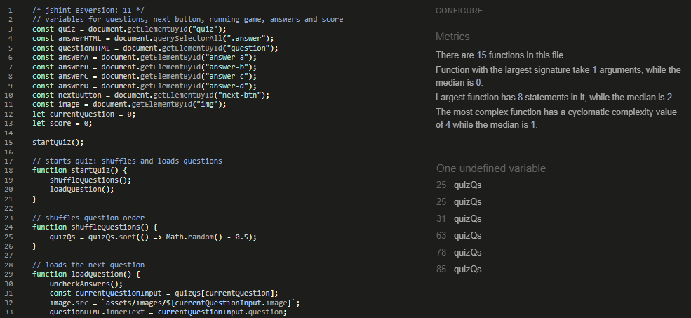 | Undefined variable from questions.js |
| questions.js | 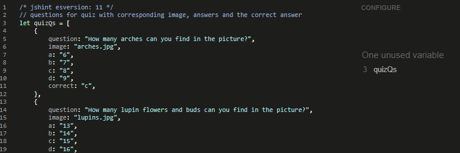 | Unused variable |

## Browser Compatibility

I've tested my deployed project on multiple browsers to check for compatibility issues.

| Browser | Screenshot | Notes |
| --- | --- | --- |
| Chrome | 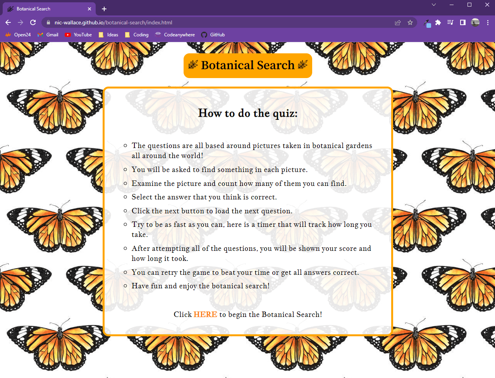 | Works as expected |
| Firefox | 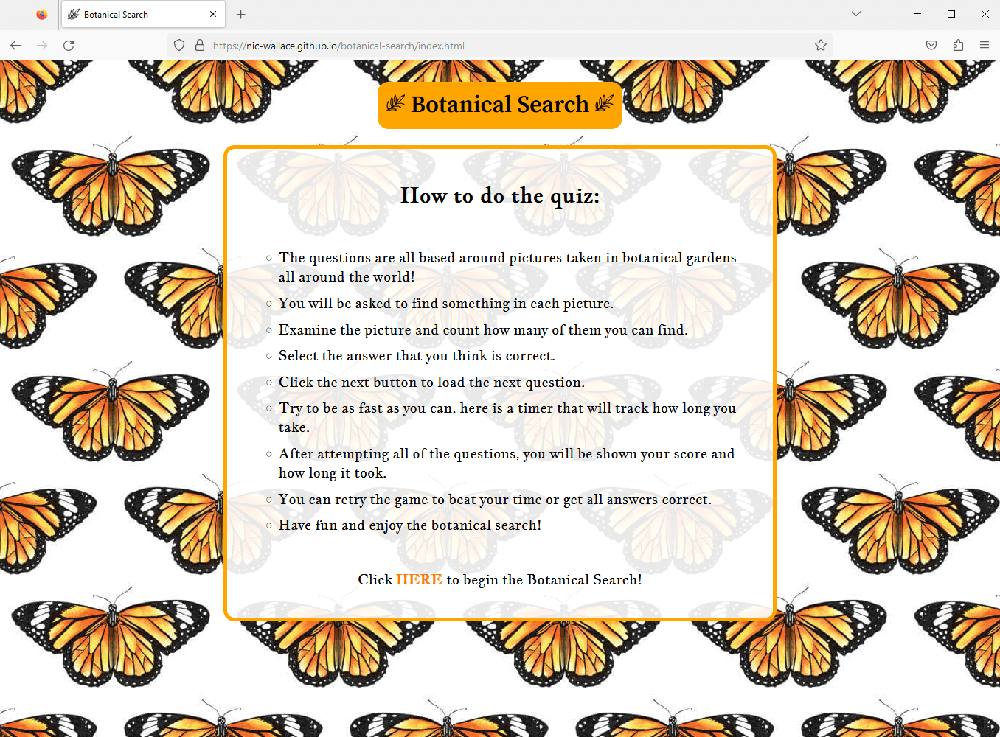 | Works as expected |
| Edge | 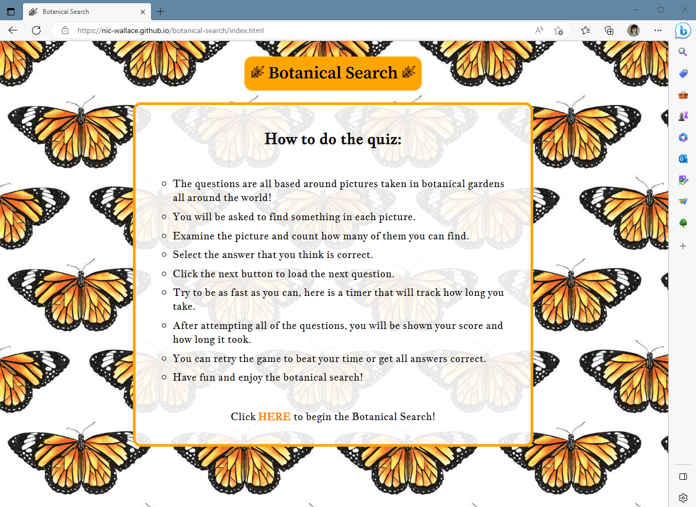 | Works as expected |
| Opera | 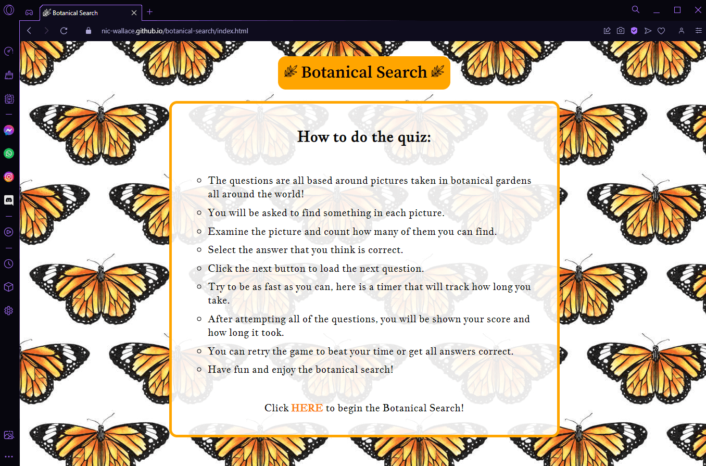 | Works as expected |

## Responsiveness

I've tested my deployed project on multiple devices to check for responsiveness issues.

| Device | Screenshot | Notes |
| --- | --- | --- |
| Xiaomi Redmi Note 10 Pro |  | Works as expected |
| Samsung Galaxy Tab A | 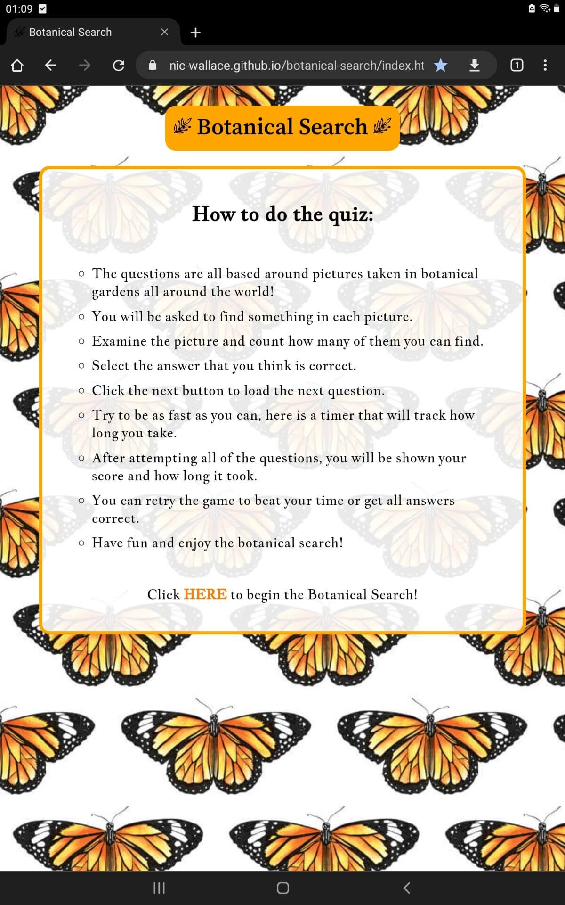 | Works as expected |
| Desktop HP vs 12| 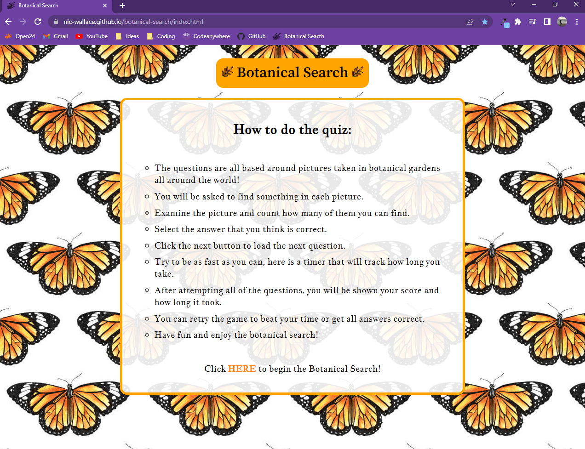 | Works as expected |
| XL Monitor DELL2407WFPHC | 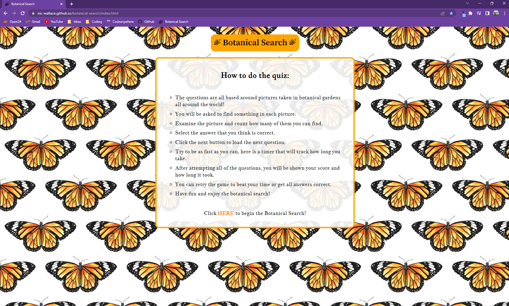 | Works as expected |

## Lighthouse Audit

I've tested my deployed project using the Lighthouse Audit tool to check for any major issues.

| Page | Size | Screenshot | Notes |
| --- | --- | --- | --- |
| Home | Mobile |  | Some minor warnings |
| Home | Desktop |  | Few warnings |
| Quiz | Mobile |  | Few warnings |
| Quiz | Desktop |  | Few warnings |

## Bugs

- JS timer stop function was not working despite trying several methods of stopping the time.

    - To fix this, I added `clearInterval(timerInterval);` into the `proceedQuiz()` function as part of the `else` clause, that will stop the timer and display the score
    if there are no more questions to display.

- Quiz radio buttons aligntment was to the right and not inline with the rest of the page.

    - To fix this, I tried applying different styles to the list items and their parent element, the style that worked was adding `padding-left: 0;` to the `ul` element.

## Unfixed Bugs

There are no remaining bugs that I am aware of.

[Back to top](#)